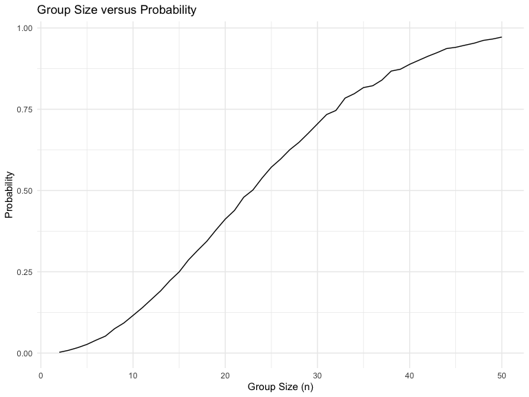
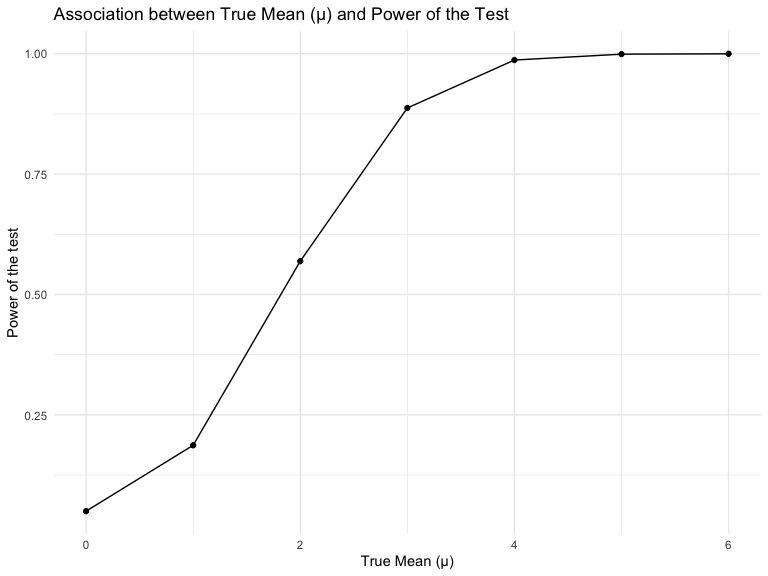
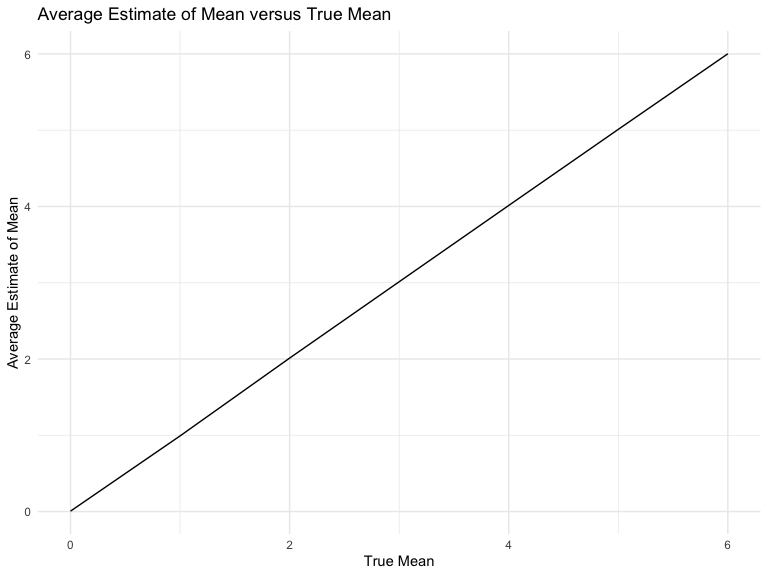
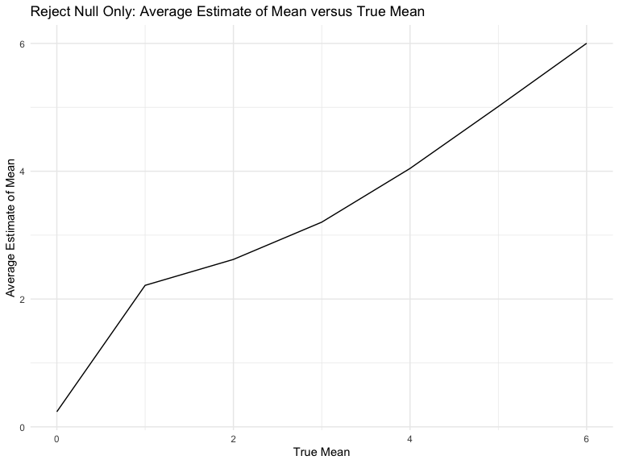
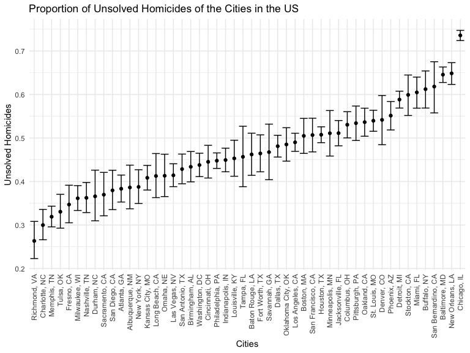

Homework 5
================

## Problem 1

``` r
bday_sim = function(n) {
  bdays = sample(1:365, size = n, replace = TRUE)
  duplicate_bday = length(unique(bdays)) < n
  return(duplicate_bday)
}

sim_res = 
  expand_grid(
    n = 2:50,
    iter = 1:10000
  ) %>% 
  mutate(results = map_lgl(n, bday_sim)) %>% 
  group_by(n) %>% 
  summarize(
    probability = mean(results)
  )

sim_res %>% 
  ggplot(aes(x= n, y = probability)) +
  geom_line() + 
  labs(
    title = "Group Size versus Probability",
    x = "Group Size (n)",
    y = "Probability"
  )
```


Based on the plot above, we can observe that the probability of two
people having the same birthday increase as the group size increases. We
surpass 50% probability of having shared birthday when the group size is
22 or bigger. As the group size approaches 50, we can see that the
probability slowly plateaus at 1, indicating that we will have at least
2 people sharing a birthday in a room with 50+ people. \## Problem 2

``` r
#simulating with mu = 0
sim_data = tibble(
  x = rnorm(n = 30, mean = 0, sd =5)
)

t.test(sim_data$x, mu = 0, alternative = "two.sided", conf.level = 0.95) %>% 
  broom::tidy()
```

    ## # A tibble: 1 × 8
    ##   estimate statistic p.value parameter conf.low conf.high method     alternative
    ##      <dbl>     <dbl>   <dbl>     <dbl>    <dbl>     <dbl> <chr>      <chr>      
    ## 1    -1.62     -2.00  0.0545        29    -3.26    0.0331 One Sampl… two.sided

``` r
#t test function
sim_t_test = function(df){
  results = t.test(df, alternative = "two.sided", conf.level = 0.95) %>% 
  broom::tidy() %>% 
  select(estimate, p.value)
  return(results)
}

#iterating 5000 times 
sim_results_df = 
  expand_grid(
    true_mean = 0:6,
    iter = 1:5000
  ) %>%  
  mutate(
    estimate_df = map(true_mean, \(x) rnorm(30, x, 5)),
    results_df = map(estimate_df, sim_t_test)
  ) %>% 
  unnest(results_df)
```

``` r
sim_results_df %>% 
  group_by(true_mean) %>% 
  summarise(
    reject_prop = mean(p.value<0.05)) %>% 
  ggplot(aes(x = true_mean, y = reject_prop)) +
  geom_point()+
  geom_line()+
  labs(
    title = "Association between True Mean (µ) and Power of the Test",
    x = "True Mean (µ)",
    y = "Power of the test"
  )
```


There is a positive relationship as the power of the test increase as
the effect size increases. However, we do see that the power eventually
plateaus as it approaches 1. There is a diminishing return in increasing
true mean beyond a certain point. Therefore, the growth is gradual and
non-linear.

``` r
sim_results_df %>% 
  group_by(true_mean) %>% 
  summarize(
    average_estimate_µ = mean(estimate, na.rm = TRUE)) %>% 
  ggplot(aes(x = true_mean, y = average_estimate_µ)) + 
  geom_line()+
  labs(
    title = "Average Estimate of Mean versus True Mean",
    x = "True Mean",
    y = "Average Estimate of Mean"
  )
```



``` r
sim_results_df %>% 
  filter(p.value < 0.05) %>% 
  group_by(true_mean) %>% 
  summarize(
    average_estimate_µ = mean(estimate, na.rm = TRUE)) %>% 
  ggplot(aes(x = true_mean, y = average_estimate_µ)) + 
  geom_line()+
  labs(
    title = "Reject Null Only: Average Estimate of Mean versus True Mean",
    x = "True Mean",
    y = "Average Estimate of Mean"
  )
```


The sampling average estimate of mean across test for which the null
demonstrates to be overestimating compared to the true mean when the
mean is small. However, as mean increases, the average estimate of mean
also becomes closer to the true mean.

## Problem 3

``` r
homicide = read.csv("data/homicide-data.csv") %>% 
  unite("city_state", city:state, sep = ', ', na.rm = TRUE)%>% 
  mutate(
    city_state = str_replace(city_state, "Tulsa, AL", "Tulsa, OK"),
    city_state = str_replace(city_state, "Milwaukee, wI", "Milwaukee, WI")
  )
```

The homicide data contains the following variables, uid, reported_date,
victim_last, victim_first, victim_race, victim_age, victim_sex,
city_state, lat, lon, disposition,and has 52179. The data spans from
20070101 to 201511105. We will be focusing on the `city_state` variable
and `disposition` variable to identify the proportion of unsolved
homicides in cities across the US. I have corrected the `city_state`
variable for both `Tulsa, OK` and `Milwaukee, WI` to reflect accurate
data.

``` r
homicide_df =  
  homicide %>% 
  group_by(city_state) %>% 
  summarize(
    total = length(disposition),
    unsolved = sum(disposition %in% c("Closed without arrest", "Open/No arrest"))
  )
```

``` r
baltimore = 
  homicide_df %>% 
  filter(city_state == "Baltimore, MD")

baltimore_prop = 
  prop.test(baltimore$unsolved, baltimore$total) %>% 
  broom::tidy() %>% 
  select(estimate, conf.low, conf.high)
```

``` r
homicide_prop = function(distinct_citystate){
  sub_df = homicide_df %>% 
    filter(city_state == distinct_citystate)
  
  prop_test = prop.test(sub_df$unsolved, sub_df$total)
  
  result_df = prop_test %>% 
    broom::tidy() %>% 
    select(estimate, conf.low, conf.high)
  
  return(result_df)
}

city_homicide = 
  homicide_df %>% 
    distinct(city_state) %>% 
    mutate(prop_result = map(city_state, homicide_prop)) %>% 
    unnest(prop_result)

city_homicide %>% 
  mutate(
    city_state = fct_reorder(as_factor(city_state), estimate)
  ) %>% 
  ggplot(aes(x = city_state, y = estimate))+
  geom_point()+
  geom_errorbar(aes(ymin = conf.low, ymax = conf.high)) +
  theme(axis.text.x = element_text(angle = 90, vjust = 0.5, hjust = 1)) +
  labs(
    title = "Proportion of Unsolved Homicides of the Cities in the US",
    y = "Unsolved Homicides",
    x = "Cities"
  )
```


